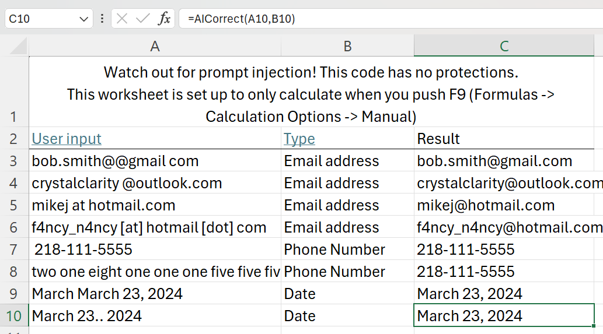
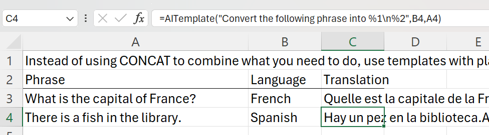
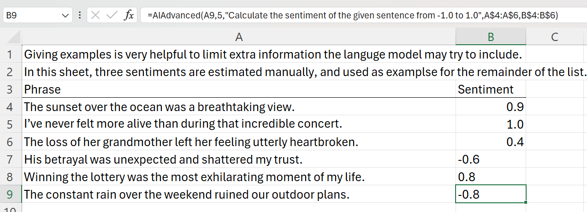

# ExcelLLM
Adds language model functions as formulas in Excel.

If you stan Excel as much as I do, you may wish you could just use a language model to clean up your data, translate between languages, categorize, calculate sentiment, or perform other text work with a language model. You can export a small table to CSV and put it in ChatGPT then copy results back, or you can use this project.

You should consider this project more like an educational experience than software you should rely on. I built it because Numerous.AI and CeLLM were expensive and I wanted to use a locally hosted model. Even if you're a great prompt engineer with ChatGPT, this project may help you learn how to prompt the programmatic API better.

# Warnings
* There is no protection against prompt injection. Probably this will only result in bad data in your workbook, but who knows if someone could escape the data and start messing with VBA code and the rest of your computer.
* You should be nervous about any VBA code or Excel workbooks with macros. There isn't that much code; read through it to make sure you understand it.
* There are no safeguards against racking up a large OpenAI bill if you connect to their API. Do not process a lot of data without estimating your future bill.

# Installation
You must have either a locally hosted language model compatible with OpenAI's chat completions, or a paid OpenAI API Key. The easiest way to host your own language model is with [LM Studio](https://lmstudio.ai/). For basic text manipulation, 7B models like Mistral usually do well but sometimes don't follow instructions.
## Option 1
Download the Excel workbook, clicking past all the warnings about macro-enabled workbooks (see the Warnings above). It includes the VBA and sample usage in three worksheets

## Option 2
1. Download AI.bas and JSON.bas.
2. Open your Excel workbook and press Alt+F11 (or select "Developer -> Visual Basic" from the menu)
3. Import JSON.bas (File -> Import File). This library is courtesy of the [VBA-JSON project](https://github.com/VBA-tools/VBA-JSON). 
4. Add a reference to "Microsoft Scripting Runtime" (Tools -> References -> check "Microsoft Scripting Runtime"). You also need to move it higher in the list than "Microsoft Office xx.x Object Library"
5. Import AI.bas

# Usage
If you start a local server at http://localhost:1234/v1/chat/completions you can skip this step. Otherwise, you must open Visual Basic (Alt+F11), open the AI module, and change the apiUrl and apiKey to the OpenAI URL and your own apiKey.
## =AICorrect
The AICorrect function uses the language model to correct typos or incorrect formats. It takes two parameters: the input data and the type of data it is. 

*Signature*: =AICorrect(value, category)

*Example*: =AICorrect(A2, "email address")

## =AITemplate
The AITemplate function simplifies prompt creation by letting you use placeholders. You could do the same with the CONCAT feature, but I find this much simpler. It takes a parameter for the template, and any number of parameters for the placeholder values.

*Signature*: =AITemplate(template,args,...)

*Example*: =AITemplate("Convert the following phrase into %1 language: %2",A3,B3)

## =AIAdvanced
The AIAdvanced function lets you specify the system prompt, few-shot examples, and max tokens. Adding examples helps prevent the model from adding more information to the response that you don't need. You must select two equal columns of prompts and completions.

*Signature*: =AIAdvanced(userPrompt,maxTokens,systemPrompt,userExamples,assistantExamples)

*Example*: =AIAdvanced(A7,5,"Calculate the sentiment of the given sentence from -1.0 to 1.0",A$4:A$6,B$4:B$6)

# Troubleshooting
The most common issue is the language model adding more information than you are asking for. It can help to include few-shot examples, either with =AIAdvanced or by editing the VBA code.

If the responses are getting cut off, increase the Max Tokens, either with =AIAdvanced or by editing the VBA code for the function you are using.

If you get HTTP errors as your response, check that your server is running and set up as specified in the VBA code.

Excel will hang and not be responsive while it is calculating. If you are processing a lot of cells, Excel will hang for longer. If you are using a local language model, make sure it is performing well. I suggest setting the workbook to manual calculation (Formulas -> Calculation Options -> Manual), or it will sometimes try to reprocess the entire workbook. Also consider pasting over the formulas by value once you have good results.
